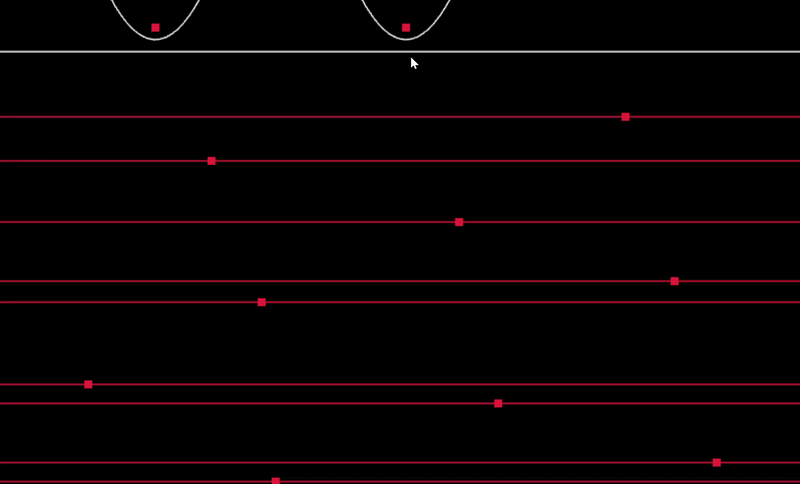

# Voronoi Diagram using Fortune's Algorithm

A C++ implementation of **Fortune's Sweep Line Algorithm** for constructing 2D Voronoi diagrams.

## Demo

<p align="center">
  
</p>

<p align="center">
  Voronoi diagram generated using Fortune's sweep-line algorithm.
</p>

The project implements the Voronoi construction algorithm from scratch using computational geometry techniques, an event-driven sweep line, and a dynamically maintained beach-line data structure. It also supports efficient **Voronoi cell traversal for nearest-neighbor queries**.

## What is Voronoi Diagram

Given a set of sites (points) in a 2D plane, a **Voronoi diagram** partitions the plane into regions such that every point inside a region is closer to its corresponding site than to any other site.

Instead of constructing these regions by directly comparing every pair of sites, this project uses **Fortune's Algorithm**, a sweep-line algorithm with a theoretical time complexity of:

**O(n log n)**

for `n` input sites.

## Fortune's Algorithm

Fortune's Algorithm sweeps a horizontal line across the plane while maintaining a structure called the **beach line** and uses the properties of parabola to partition the plane.

Two types of events drive the algorithm:

### Site Events

A site event occurs when the sweep line encounters a new input point.

The corresponding parabola is inserted into the beach line, splitting the currently active arc and creating new potential Voronoi edges.

### Circle Events

A circle event occurs when three neighboring beach-line arcs converge.

At this point:

* The middle arc disappears.
* A Voronoi vertex is generated.
* Existing Voronoi edges are completed.
* A new edge begins between the two remaining neighboring regions.

Events are maintained in a **priority queue** and processed according to their position along the sweep direction.

## Beach Line Representation

The beach line is represented using a **binary tree**.

The tree contains two kinds of nodes:

* **Arc nodes** — represent parabolic arcs associated with input sites.
* **Edge nodes** — represent breakpoints between neighboring arcs and developing Voronoi edges.

Tree traversal is used to determine the active arc for a new site event and to locate neighboring arcs and edges when processing circle events.

## Voronoi Cell Construction

After Fortune's Algorithm generates the Voronoi edges, the edges are grouped according to the sites they separate.

Each Voronoi cell stores:

* Its corresponding site
* The edges belonging to the cell
* Adjacent Voronoi cells/sites

This creates an adjacency representation of the generated Voronoi diagram.

## Point Location / Nearest Neighbor

The project also implements point location using the Voronoi cell adjacency graph.

Starting from an initial cell, the algorithm compares the query point against neighboring sites and moves toward a closer Voronoi cell until no neighboring site is closer.

The resulting cell identifies the **nearest site to the query point**.

For correctness testing, the result is also compared against a brute-force Euclidean distance search over all sites.

## Project Structure

```text
voronoi-diagram/
│
├── voronoi.cpp     # Fortune's algorithm, event processing and main program
├── vtree.h         # Beach-line binary tree traversal utilities
├── cells.h         # Voronoi cell construction and point-location logic
├── helper.h        # Vector and geometric helper functions
├── ani.mp4         # Visualization / demonstration
└── README.md
```

## Data Structures Used

### Event Queue

A priority queue stores pending sweep-line events:

```text
Site Event
    ↓
Insert new arc into beach line
    ↓
Create new Voronoi edges

Circle Event
    ↓
Remove disappearing arc
    ↓
Create Voronoi vertex
    ↓
Complete / create edges
```

### Beach Line Tree

```text
              Edge
             /    \
           Arc    Edge
                 /    \
               Arc    Arc
```

Leaf nodes represent arcs while internal nodes represent breakpoints/Voronoi edges.

## Features

* Fortune's sweep-line algorithm implemented in C++
* O(n log n) Voronoi construction
* Priority-queue based event processing
* Site event handling
* Circle event detection and handling
* Binary-tree representation of the beach line
* Voronoi edge and vertex construction
* Voronoi cell adjacency generation
* Nearest-neighbor / point-location queries
* Euclidean-distance verification for correctness
* Custom geometric utilities without relying on a Voronoi library

## Building

Compile using a C++ compiler such as `g++`:

```bash
g++ -std=c++17 voronoi.cpp -o voronoi
```

Run:

```bash
./voronoi
```

On Windows:

```bash
voronoi.exe
```

## Example

The program can construct a Voronoi diagram for sites such as:

```cpp
vector<Vector2> sites = {
    {1.0f, 1.0f},
    {5.0f, 1.0f},
    {3.0f, 4.0f},
    {7.0f, 3.0f},
    {2.0f, 6.0f}
};
```

After constructing the diagram, query points can be located in their corresponding Voronoi cells to determine their nearest site.

## Concepts Used

* Computational Geometry
* Fortune's Algorithm
* Sweep Line Algorithms
* Voronoi Diagrams
* Priority Queues
* Binary Trees
* Euclidean Geometry
* Nearest-Neighbor Search
* Graph / Cell Adjacency

## Complexity

For `n` sites, Fortune's Algorithm processes O(n) site and circle events.

Each event requires operations on the event queue and beach-line structure, giving an overall theoretical complexity of:

```text
Time:  O(n log n)
Space: O(n)
```

---

This project was built to explore the implementation details behind **Fortune's Algorithm and Voronoi diagrams**, including sweep-line event processing, dynamic beach-line maintenance, geometric intersection calculations, and Voronoi-based nearest-neighbor search.
